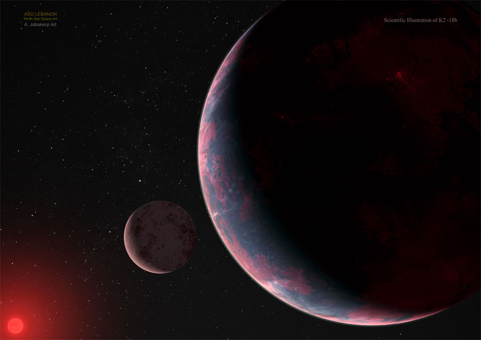

# NASA_image_generator
Downloads random space images from NASA website daily with description

Before starting this you have to go to NASA.api.gov and create an account so you 
can get the api token to make this program work

